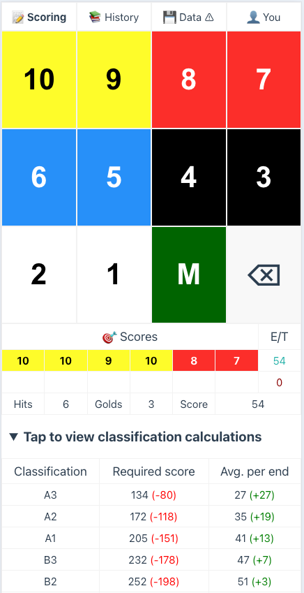
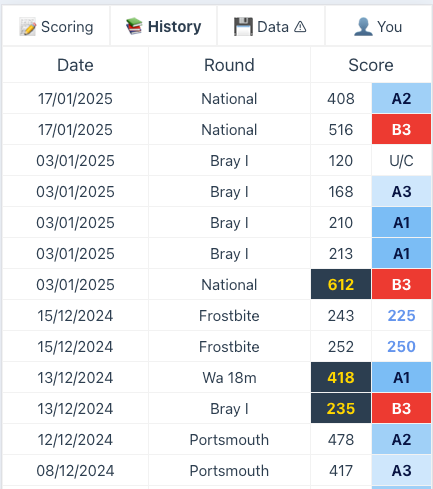
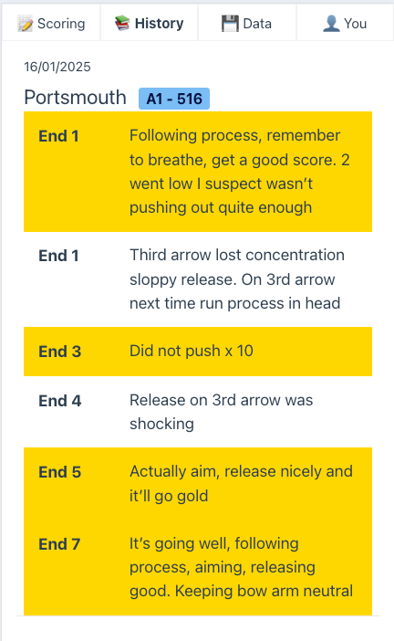
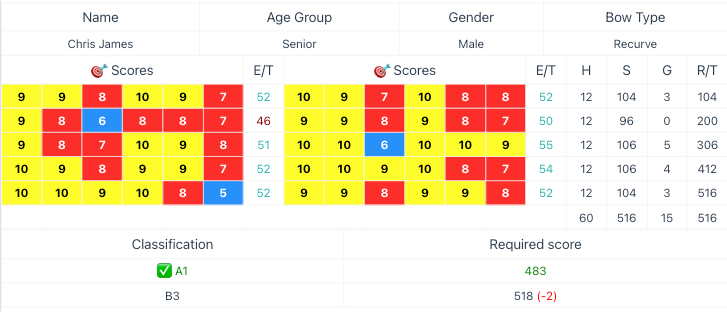

# fast

> [When shooting is taking place, it will be under the control of a Field Captain who will indicate when it is safe to shoot, but every archer can play a part in this. If you see anything that gives a cause for concern, then call out “FAST” and all shooting will cease, even if an archer is at full draw they must let down the bow and wait.](http://bowmenofardleigh.com/shooting/glossary-of-archery-terms/#:~:text=SAFETY,on%20the%20bow.)

**Fast**, is an app that allows an archer to record their scores as they go through their ends, rounds and shoots.
Calculates running totals, hits e.t.c. on the fly. Works on anything that has a modern web browser, so iOS, Android, or
even your laptop.

https://winter-feather-5776.fly.dev

## Key Features

- **Quick Scoring**: Rapid input of arrows with intelligent validation for different round types
- **Works Offline**: Built as a Progressive Web App (PWA), works without internet and can be installed on your phone
- **Round Support**:
  - All major imperial rounds (National, Windsor, etc.)
  - Metric rounds (WA 70m, Frostbite, etc.)
  - Automatically enforces correct scoring zones and arrow counts
- **Smart Notes**: Take notes during your shoot, highlight important observations
- **Comprehensive History**: Review all your shoots with detailed statistics
- **Data Safety and ownership**: Export your data for safekeeping, with friendly reminders to back up
- **Archery GB classification**: Automatically calculates and projects your classification based on your scores, age
  group, sex and so on.

## Perfect For

- Club archers tracking their progress
- Coaches monitoring student development
- Anyone wanting to improve their archery through data-driven insights
- People who are not great at arithmetic 😉

## Built For Archers

Large, easy-to-tap buttons, and only includes valid arrow scores for the round you are shooting.

Keep a history of your shoots to see how you're progressing. Let's you know what classification each shoot achieved.

Many coaches recommend keeping a diary of your shoots, recording what has gone well, what mistakes were made and so on.
In Fast you can record notes as you shoot, and then later review them in the diary. You can highlight a note just by
tapping it.

Rotating your phone will show you the full scorecard, automatically calculated. It correctly follows the rules around
gold counts and Xs depending on the round you are shooting.

## Tech waffle

- [Vue](https://vuejs.org/) - A progressive, incrementally-adoptable JavaScript framework for building UI on the web.

Whilst I am a huge [HTMX](https://quii.dev/HTMX_is_the_Future) fan, for this I wanted a static website, so that I wouldn't have to pay for a database, and I can keep the hosting cheap. I also wanted to try out Vue, so this was a good opportunity to do so. 

It's been a lot of fun, the event system and reactivity is simple and I find it more intuitive than React. If I were to start a project where I knew I'd need something very client-side heavy, which wouldn't be appropriate for HTMX, I'd definitely consider Vue.